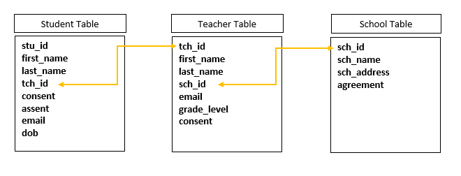
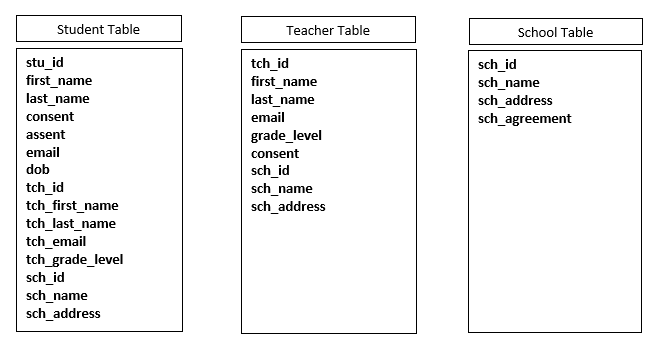

```{r setup, include=FALSE}
options(htmltools.dir.version = FALSE)

library(tidyverse)
library(kableExtra)
```

# You've chosen your measures.........

## Now it's finally time to

--

```{r echo=FALSE, fig.align="center"}

```

---

# Topics for today

--

* Writing your Consent Form

--

* Data Collection Instrument Design

--

* Maintaining Data Security in the Field

--

* Creating a Tracking Database

--

* Data Storage and Security

--

* A Glimpse into File Structure

---

# The Institutional Review Board (IRB)

* A formal organization designated to review and monitor human participant research

* Ensures that the welfare, rights, and privacy of research participants are maintained throughout the project

* All data collection materials will be vetted by the IRB

* Always submit your materials to the IRB before collecting data

--

**Or Else!**

```{r fig.align="center", echo=FALSE}

```

---

# Consent form

* Work with your data manager and your IRB to write a consent using language that allows for future data sharing

  + Don't promise to destroy your data (unless your funder explicitly requires it)  
  
  + Don't promise to not share data  
  
  + Do get consent to retain and share data  
  
  + Do incorporate data-retention and sharing clauses into IRB templates  
  
  + Do be thoughtful when considering risks of re-identification (ex: small sample size for sub-groups)

<br>
<br>
<br>

Source: [Meyer (2018)](https://journals.sagepub.com/doi/10.1177/2515245917747656)

---

# Consent form language

* Compared to consent forms of the past, if you plan to share your data, language needs to be added to several **sections** of your consent

<br>

Starting with the **Purpose of the Study**:

```{r fig.align="center", echo=FALSE, out.width='80%'}

```

<br>
<br>

Source: [Shero and Hart](https://figshare.com/articles/preprint/Informed_Consent_Template/13218773/1)

---

# Consent form language cont.

* **Risks**
  + Minimal risk due to de-identification
  + No guarantee a participant won't be re-identified

* **Statement of Confidentiality**
  + You can list specific identifying variables that will be removed from data before sharing
  
* **Voluntary Participation**
  * Participants can opt out before data is shared
  * Participants can request their data only be used by researchers, not available to public
  
* **Contact Information**
  + PI contact information
  + Link to the repository you plan to use (if known)
  
Source: [Shero and Hart](https://figshare.com/articles/preprint/Informed_Consent_Template/13218773/1)

---

# Data collection instruments

Some of the most common instruments used in original education research include:

  * Consents/Assents
  * Surveys
  * Assessments
  * Observations
  * Interviews/Focus Groups (not covering today)
  
<br>

Secondary data sources that are often also included in studies:

  * District or school record data
  * Publicly available records (State Department of Education data)
  * Previously collected data or data from other studies
  
---

# Web-based data collection tools

If at all possible, I recommend building/utilizing web-based data collection tools as opposed to paper.

* Forms are easier to maintain/update
* Reduces cost and effort of manual printing and collating
* Easier to track completion
* More efficient than manually entering or manually scoring data (including TeleForm)
* Reduces errors in both data collection as well as data entry/scoring
* Can reduce missing data
* Quick turnaround of clean data (you can rename/recode variables in the survey)
* Provides more data privacy than paper data
* Streamlines pipeline for real-time reporting/dashboarding options
* Able to use crowdsourcing options such as MTurk and Prolific

**With COVID-19**: Provides flexibility to collect data even when you aren't able to physically be in schools

---

class: inverse

# Surveys

If at all possible, use a web-based survey.

Options:

  * Use an existing survey platform (Qualtrics, SurveyMonkey, Google Forms)
  * You can hire a developer to build an app for you
  * You can build your own application to collect data in tools such as R or Tableau
  
There are entire books and courses on best practices in survey research and questionnaire design.
  
Take time to consider how the data you collect will be *translated into a database*

```{r fig.align="center", echo=FALSE, out.width='90%'}

```

---

# Web-based surveys cont.

These suggestions will **reduce future data management headaches**:

1. Correctly name all of your survey items
  + Q1 = s_gender
1. Correctly code all of your values
  + 1 = strongly disagree, 2 = disagree.......
1. Use data validation
  + Content validation
     - Restricting birth date field to only a date
  + Response validation
     - Force response
     - Request response
1. Use the same question format across and within studies
  + If *anxiety1* was a slider 1-10 in the fall, keep it as a slider 1-10 in the spring
```{r fig.align="center", echo=FALSE, out.width='65%'}

```

---

# Web-based surveys cont.

5\. Only ask one piece of information per question
  + Don't ask: Provide the % proficient in math and comm arts
  + Do ask: 
      - (1) Provide the % proficient in math. 
      - (2) Provide the % proficient in comm arts.
  
6\. Make your question wording abundantly clear.
  + Don't ask: Are you from this county?
  + Do ask: Do you currently live in this county?
  
7\. Make your response options abundantly clear.
  + Don't ask: Which parent are you? (m/f)
  + Do ask: Which parent are you? (mother/father/legal guardian/other)
  
---

# Web-based surveys cont.

.pull-left[
8\. If there is a finite number of response options (< ~ 20), use a drop down.
  + School Name: South Middle, North Middle, West Middle, East Middle

9\. If there is an infinite number of response options, use an open text box
  + Do not make people select from a massive list of options
]

--

.pull-right[
```{r echo=FALSE, out.width='70%'}
knitr::include_graphics("img/response_opt2.png")
```

Source: [Twitter](https://twitter.com/niais/status/1352759154939633664)
]

---

# Web-based survey feedback

.pull-left[
**Always get feedback before sending your survey out!**

* Send the survey to colleagues to test out
* Have them use a name such as "test"
* You can always delete this out in the platform or during data cleaning later

You want to know things like:

* Was any language unclear?
* Was there any funky skip logic?
* Was a response option left out or maybe an entire question from a measure?

Download that test data:

* When you download their test data, does it look as you expected?
]

.pull-right[
<br>

```{r echo=FALSE, out.width='90%'}

```
]
---

# Offline surveys

If your participants or sites do not have access to internet or WiFi, there are options.

1. Utilize an offline survey app option (available in platforms such as Qualtrics)
  + Create the survey online
  + Administer it using an offline survey app
  + The data saves in the app on your device
  + Then you can upload that data back to the online survey platform when you have a connection again
  
1. Use TeleForm or Scantrons
  + Machine readable forms

---

# Offline surveys cont.

3\. Collect paper survey data

  + Build the following into your field protocol
      - Check for missing data in the field
      - Check for missing data again as soon as you return to the office
      
  + Build the following into your data entry protocol
      - Set up a data entry station
      - Have clear instructions for handling paper data (where and how to store it securely)
      - Set up clear databases for entry
          + Restrict entry fields
      - Have clear instructions for data entry
          + How to handle missing data
      - Set up a system for error checking
          + Double entry of data

---

# Assessments

* If at all possible, use web-based assessment tools
  + For example, Renaissance STAR assessment is administered and scored online
  
* If the assessment you have chosen for your study is only available in paper form, consider converting it to a web-based form

  + Build the assessment into an online survey platform
  + Build your own application to collect data
  + Once data is collected, proceed with scoring as usual

* If there are no web-based options (ex: Woodcock Johnson), or connecting to WiFi is not an option, keep with your paper assessment
  + Make sure to implement an error checking system
  
---

# Observations

* Observation forms can be built into an online survey platform or your own application
  + Data collectors can access them on their phones, tablets or laptops in the field
  + If the observation has duration codes, use/build an app with a timer

* If WiFi is not available, if at all possible, make a form that eliminates data entry
  + Use existing tools (Ex: The Mooses/Lily program created at Vanderbilty University)
  + Create an Excel template that observers enter data into
  + Create a Microsoft Access form
  + Utliize offline survey apps (like the one available in Qualtrics)
  
* **Caution**:
  + Tools that are not connected to a shared database are tricky
  + You must set up a way for data collectors to securely share files with you
  + The data manager is then responsible for merging these files together

---

# Consents

* These can also be collected through secure web-based tools
  + Examples: Qualtrics, DocuSign
  
* Most importantly, consult your IRB to see what tools are approved

<br>

--

**Or Else!**

```{r fig.align="center", echo=FALSE}

```

---

# All-in-One study

* It is entirely possible to build your entire study, or large parts of it, into one tool.
  + This can be done in a tool like Qualtrics or by building your own app in a tool like R Shiny
  + Just make sure that your tool meets security requirements for your study

<br>

```{r fig.align="center", echo=FALSE}

```

* In this case you can even build your data collection tracking into this tool

<br>
<br>
<br>

Source: [Lucy D'Agostino McGowan](https://docs.google.com/presentation/d/1FtI4KeX3C8cFBJi0NeTURqfXphrQ2W8sxoDQAd7LrRo/edit#slide=id.p)

---

# Security in the field

* Researchers are always balancing two things: Participant confidentiality and accurate data

* IRB requires that
  + Participants do not know their study IDs
  + No document should ever have both participant name and study ID on the same form
  
* However, if your study is longitudinal, maintaining accurate study IDs over time is crucial

```{r echo=FALSE, out.width='20%'}

tibble::tribble (~ stu_id, ~ s1_item1, ~s2_item1, ~s3_item1, ~s4_item1,
                 1268, 5,4,NA, 3,
                 1286, NA, NA, 3, NA,
                 1306, 2, 3, 5, 1,
                 1245, 5,4,3,4) %>%
gt::gt()
  
```

* Is 1286 a real ID? Or did 1268 get transposed/entered incorrectly?

---

# Web-based data collection security

Options when sending out web-based surveys/assessments:

1. Send unique links to each participant, easily created using a panel
  * Pros:
      + Best way to ensure you have the correct study IDs
  * Cons:
      + Must keep links organized and sent to correct person
      + Best if project team is the one sending out the links
      
--
      
2\. Send one link to all participants and use a double ID
  * Pros:
    + Easy to make and send one link
  * Cons:
    + Have to create and track a double ID
    + Room for error with entering double ID


For either of these options, on the first page of the survey, have them verify their identity based on the link they used and/or the ID they entered. This reduces errors!

---

# Web-based data collection security cont.

3\. Send one link to all participants and have them enter their name
  * Pros:
      + Easy to make and send one link
  * Cons:
      + Most problematic in terms of data management and linking to IDs
  
--

Other precautions to take:

* Instruct participants to close their browser at the completion of their survey
* If you are collecting anonymous data, do not collect IP address
* Make sure you using/building data collection and storage tools that are approved by your IT department and are considered secure for your data's level of sensitivity
* For in-field data collection devices (tablets, phones, laptops):
  * Make them password secure
  * Never leave devices open and unattended
  * Encrypt any identifiable information

---

# Offline data collection security

If you take paper forms into the field and you need participant name, consider doing one of the following to link names to IDs at a later time:

1. Write the study/participant ID on the form, then use a reusable label with participant name and place that over the ID.

1. Attach a cover sheet to each form that includes identifying information. Then when returning to the office remove the cover sheet and write the study ID on the form.

1. If you need both the name and the ID in the field, consider using two separate forms (one with a double ID).

```{r fig.align="center", echo=FALSE, out.width='60%'}

```

---

# Offline data collection security cont.

Other precautions to take:

* No matter what method you use to take names and/or IDs into the field, **always** double check your IDs when you get back to the office, before you remove the name, and before you enter the data.

* **Always** shred paper with names and other identifiers on them

* Make sure all paper forms are kept in a folder or even a secure lock box, **with you** at all times in the field

* When you return to the office, make sure paper forms are stored according to your IRB rules (usually a locked file cabinet)

---

# Tracking

There are many pieces of information that need to be tracked for a research study.

* Consents and assents
* Participant information
* Incentives/Payments
* Data collection completion
* Participant movement

.pull-left[

And all of this needs to be tracked across time (waves and cohorts) and space (classrooms and sites).

<br>
<br>
<br>
Img: [Flaticon](Flaticon.com)
]

.pull-right[
```{r echo=FALSE, out.width='80%'}

```

]

---

# Tracking system

Some people use other terms for this (such as roster).

Whatever you call it, this system is vital for the following:

* Ensure you collect all your data
* Scheduling and project coordination
* Understanding what occurred during data collection
* Consort diagram creation
* Attrition analysis
* Final dataset verification (does your N match tracking)

Project coordinators and data managers must work together when setting up this tracking system to ensure:

* You are collecting all relevant pieces of information
* Your database is understandable when it comes time to cross-reference data

---

# Building a tracking database

You can build this tracking database in any software you choose such as:

* Microsoft Access
* Microsoft Excel
* Web-based platform such as QuickBase, Salesforce, or RedCap
* A survey platftorm such as Qualtrics
* Forms that feed into a SQL database

My recommendation: *A relational database system that allows you to pull tables together using a query system*. 

* Eliminates redundant data
* Increases performance
* Decreases storage
* Makes it much easier to update tables as changes occur

---

class: inverse

# Building a tracking database

Relational database

```{r fig.align="center", echo=FALSE, out.width='60%'}

```

Non-relational database

```{r fig.align="center", echo=FALSE, out.width='60%'}

```

---

class: inverse

# Querying a relational database

Even though our student table does not have teacher name in it, we can now use a query to pull a roster together for every teacher.

This query:

```{r fig.align="center", echo=FALSE, out.width='90%'}

```

Would produce a roster like this:

```{r fig.align="center", echo=FALSE, out.width='60%'}

```


---

# Setting up your tracking database

No matter what tool you use to track, consider the following:

* **Just track! Even if it is in the most simple excel table, just track!**
* Create one table per entity (participants, sites, districts)
* Only include participants who have consented
* Make entry clear
  * Split out first name and last name
* Restrict entry values in your system
  * Example only allow (yes/no), or a drop-down list of school names
* Consider how you want to track data over time
  * Do you want all time points in the same table or a different table for each time point?
  * Do you want cohorts in separate tables or same table?
* Use versioning
  * You may need to go back to an older version of your tracking system if a mistake was made
* Make sure your system easily allows you to export data
  * Print rosters, print labels
* Keep the tables consistent across time for continuity and ease of understanding
  * Always label columns the same way, allow the same values

---

class: inverse

# Fields to include: IDs

In ANY table, always include a Participant ID and/or Location IDs

What is an ID?

* As you recruit participants/schools, you will add them to your roster/tracking database under an ID

* This ID allows participants to remain confidential in your research data

* The ID is typically a 2-6 random numeric or alphanumeric value

* It must be **unique** to that individual

* It follow that individual for the **entire** study. It **never** changes.

```{r fig.align="center", echo=FALSE, out.width='60%'}
knitr::include_graphics("img/IDtable.png")
```


---

# Fields to include cont.

The following can be placed into a separate demographics/participant table (roster) OR kept in your data collection tracking:

* Participant/Site Name
* Contact Information/Emails
* Other IDs necessary for linking (ex: student ID for school records)
* Relevant study demographics
* Schedule information needed for the study (block, class time)
* Consent/Assent received
* Randomization information (cohort, group)
* Payment information (ex: W9)
* Double IDs if you use these for data collection

---

# Fields to include cont.

If your study is longitudinal these are fields you will track over time (each wave of collection):

* Data collected (each unique piece)
  * Observation complete (yes/no)
  * Interview complete (yes/no)
* Participant movement
* Notes
* Payment/incentives provided

.pull-left[

Student roster table
```{r echo=FALSE, out.width='20%'}

tibble::tribble (~ stu_id, ~ stu_f_name, ~stu_l_name, ~tch_id, ~email, ~dob,
                 26389, "Johnny", "Rose", 263, "rosej@school.edu", "12/03/2006",
                 26392, "Alexis", "Rose", 265, "rosea@school.edu", "11/15/2005") %>%
gt::gt()
  
```

]

.pull-right[

Student data collection table
```{r echo=FALSE, out.width='20%'}

tibble::tribble (~ stu_id, ~ tch_id, ~t1_svy, ~t2_svy, ~t1_incent, ~t2_incent,~moved,~notes,
                 26389, 263, "yes", "no", "yes", "no", "yes", "left district 02/10/2021",
                 26392, 265, "yes", "yes", "yes", "yes", "no", "") %>%
gt::gt()
  
```
]

---

# Tracking best practices

There are a few best practices that improve project coordination and data management.

* Only track data that you physically have
  + Don't track data that someone tells you they collected

* Track daily throughout data collection
  + This improves the accuracy of your tracking, your project coordination and your data

* Only track complete data
  + If a survey was only partially completed and you plan to send it back out, mark this in the notes but don't mark it as completed
  
---

# Data storage and security

Whether you are collecting original data, or you are working with existing data, you need to consider secure short-term data storage. First and foremost, follow your IRB rules. 

Level of security with depend on the type of data:

* Anonymous Data
  + Data at no time has ever had identifying information tied to it and can never be linked back to an individual
* Confidential Data
  + Personally Identifiable Information (PII) in your data has been removed and names are replaced with a study ID
  + Identifiers are stored in a separate tracking database
* De-identified data
  + All PIIs are removed AND there is no longer a link to a participant's identity anywhere
* Identifiable data
  * Includes PII
  
  
---

background-image: url(img/ldbase2.png)

# What are examples of PII?

<br>
<br>
<br>
<br>
<br>
<br>
<br>
<br>
<br>
<br>
<br>
<br>
<br>
<br>
<br>
<br>
<br>

Source: [LDbase.org](https://venngage.net/ps/5p6yjaAGTSs/new-5-things-to-check-for-data-deidentification)

---

# Storing a tracking database

This data has identifiable information and must have the highest security.

General rules:

* Store this database separately from your confidential research study data
* Limit access to this database
* Store this on a password-protected, institution sponsored shared network or approved cloud service with encryption
* Back this data up regularly
* Make a plan to destroy this data after study completion

```{r fig.align="center", echo=FALSE, out.width='30%'}

```
Img: [Flaticon](Flaticon.com)

---

# Storing electronic records

Here I am referring to your research data files (.csv, .txt, .sav, .docx, .R, etc.)

General rules:

* Remove all identifiers and include study IDs
* Store this data on a password-protected, institution sponsored shared network or approved cloud service with encryption
* Limit access to this data
* Have a data backup policy
* Make sure you are meeting any required regulations such as FERPA or HIPPA

```{r fig.align="center", echo=FALSE, out.width='30%'}

```
Img: [Flaticon](Flaticon.com)

---

# Storing detachable media

This includes external hard drives, flash drives, CDs, etc.

General rules:

* Store behind two locked doors
* Do not store at a personal residence or leave in a vehicle
* Password protect these items

<br>

```{r fig.align="center", echo=FALSE, out.width='30%'}

```
Img: [Flaticon](Flaticon.com)

---

# Storing audio/video data

This data is especially sensitive as it may contain names and faces as part of the recording.

* Use approved software that is licensed by your institution
* Make sure the software and cloud storage is HIPPA and/or FERPA compliant if you need it to be
* Conduct the call in secure/private location
* If recording the session, notify participants that they are being recorded
* Store sessions on an institution approved cloud service or managed service
* Once transcripts are created, make a plan to destroy the recordings

These same rules apply to data that is recorded in person.

And any data recorded on detachable media should follow the detachable media guidelines.

```{r fig.align="center", echo=FALSE, out.width='20%'}

```
Img: [Flaticon](Flaticon.com)

---

# Storing paper data

General rules:

* De-identify all paper data
  + An exception to this is paper consents/assents that contain signatures
* Store behind two locked doors
* Never store at a personal residence or leave in your vehicle
* When transporting data from a site to your office, consider keeping files in a lock box and use a personal vehicle rather than public transit

```{r fig.align="center", echo=FALSE, out.width='25%'}
knitr::include_graphics("img/paper.png")
```
<br>

Img: [Flaticon](Flaticon.com)

---

# Sharing data

If you need to share data during a project, follow these guidelines:

* Choose secure methods of file transfer
  + Upload encrypted files to cloud storage approved by your institution
  + Email an encrypted file, sharing the password separately
  + Mailing encrypted files stored on an encrypted device
* How **not** to share data:
  + Never share data with PII via email
    - This includes even password-protected Excel files
  + Never mail unencrypted media (ex: flash drive)
  + Don't upload unecrypted data to cloud storage

<br>
<br>
<br>
<br>

Source: [J-PAL](https://www.povertyactionlab.org/sites/default/files/Data_Security_Procedures_December.pdf)

---

# General security rules

* Password-protect devices (with strong passwords)
* Never leave a device open and unattended
* Restrict access to only those who need it, and remove it when people leave your team
* Keep your virus protection up to date
* Use encryption at all points in the data flow (from collection to storage)
* Encrypt any identifiable information on portable devices
* Make regular back-ups of your data

```{r fig.align="center", echo=FALSE, out.width='70%'}

```

Img: [Vicky Steeves](https://www.oercommons.org/courses/data-management-reproducibility/view)


---

# General security rules cont.

* Don't send PII via email
* If PII is collected, promptly remove it and replace it with study IDs
* Never store identifiable information on your desktop
* Have a data security plan in writing for each project
* Have staff review and sign data responsibility agreements
* When deleting data, consider using data erasing software
* Review your institution's classification levels to identify the security you need to meet requirements such as HIPPA or FERPA
  + Public
  + Sensitive
  + Restricted
  + Highly Restricted
* **Consult your IRB and IT staff for recommendations on data storage, security, and sharing data**

Source: [University of Missouri](https://www.umsystem.edu/ums/is/infosec/classification-definitions)

---

# Directory structure

Wherever your team stores your files, you need to have a logical directory structure.

Write that structure into a style guide and keep it consistent across projects.

* Makes it easier to find files
* Facilitates sharing
* Streamlines your code paths

At the highest organization level you will want to have:

1. Separate folders for each of your projects
2. An overall *Team* folder 
  + Meeting notes
  + HR documents
  + Team expectations
  + Style guide


---

# Directory structure: Project folders

Within each project folder you will want to develop a structure.

```{r echo=FALSE, comment=NA}
library(data.tree)

project2 <- Node$new("project-name")
  lifecycle <- project2$AddChild("life-cycle-folder")
    time <- lifecycle$AddChild("time")
      datatype <- time$AddChild("data-type")
        participant <- datatype$AddChild("participant")
          archive <- participant$AddChild("archive")
          
print(project2)

```

<br>

* Level 1: Project Name
* Level 2: General research life cycle (data, documentation, project mgmt)
* Level 3: Time period or grouping
* Level 4: Specific data type (Ex: raw, syntax, clean)
* Level 5: Participant specific 
* Level 6: Older versions of files

---

# Next data management training

Our next training is planned for Friday March 12th at 2pm!

We will be talking **Style Guides**!

Best practices for directory structure, file naming, variable naming and more!

```{r fig.align="center", echo=FALSE, out.width='35%'}

```
